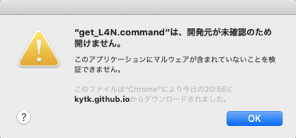
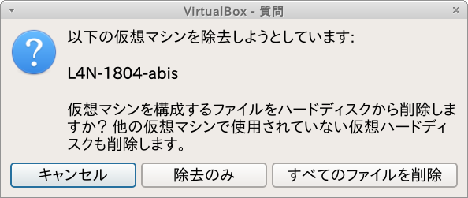

# 第9回ABiS脳画像解析チュートリアル用Lin4Neuroのセットアップ

## 目次

- [はじめに](#anchor0)
- [事前準備](#anchor1)
    - [A. チュートリアル用Lin4Neuro仮想アプライアンスのダウンロード (2-3時間) (第8回受講者はスキップ)](#anchorA)
    - [B. VirtualBox 6.1.16以降 のインストール (10分) (第8回受講者はスキップ)](#anchorB)
    - [C. Lin4Neuro仮想アプライアンスのインポート (15分) (第8回受講者はスキップ)](#anchorC)
    - [D. 仮想マシンの設定 (5分) (第8回受講者はスキップ)](#anchorD)
    - [E. Lin4Neuroの起動と設定 (10分) (第8回受講者はスキップ)](#anchorE)
    - [F. チュートリアルテキストの入手 (3分)](#anchorF)
    - [G. データの入手 (30-60分)](#anchorG)
    - [H. 受講のためのスクリプトを実行 (約15分)](#anchorH)
    - [参考. 仮想マシンの削除](#anchorI)
- [問い合わせ](#anchor2)
- [トラブルシューティング](#anchor3)

<a id="anchor0"></a>

## はじめに

- **チュートリアルの準備には、約4-5時間必要となります。時間に十分に余裕をもって準備をされてください。なお、準備が終わった方にのみ当日のZoomのリンクが送信されますので、必ず準備を行ってください。準備なしの参加はできません**

- 今回は完全オンライン開催ですが、受講者専用サイトに記載されているVirtualBox＋Lin4Neuroの組み合わせで参加することで、過去のチュートリアルと同様にチューターや講師による手厚いサポートが受けることができます。脳画像解析の初心者の方々は受講者専用サイトに記載されている通りに事前準備を行いチュートリアルへ参加することを強く推奨します

- 自分自身で基礎的なトラブルシューティングが行える脳画像解析の経験が豊富な中級者以上の方々は、受講者専用サイトに記載されている以外の解析環境（例えば受講者自身が構築した解析環境など）でもチュートリアルに参加可能ですが、原則としてチューターによるサポートの対象外とさせて頂きますので、ご理解、ご協力の程、よろしくお願いします

- チュートリアルに十分な環境で参加していただくために、受講環境を整えたうえで、スクリプトを実行してその値が正しい場合に限り当日のZoomアドレスをお送りします。**2021年1月15日までに**必ず以下の手順を実行してください。テストスクリプトを実行できた方が受講できます

- 第9回チュートリアルでは、準備ができた方に受講者専用のSlackに招待します。そちらでさらに情報がありますので、ここの準備が終わった後は、Slackをご確認ください。

<a id="anchor1"></a>

## 事前準備

- Lin4Neuroは第8回、第9回のチュートリアルにあわせてアップデートされています。**過去のLin4Neuroは使用できませんのでご注意ください**

- ソフトウェアとデータのダウンロードで合計 40GB程度ダウンロードします。Pocket Wi-Fiなどでは確実にパケ死しますので、職場やご自宅のLAN環境から作業してください

- 第8回ABiS脳画像解析チュートリアルに参加した方はLin4Neuroをそのまま使用できますが、仮想マシンのメモリとCPUの設定は見直していただくことを推奨します。**CONNはメモリをかなり消費します。また、CPUも消費します。そのため、メモリはデフォルトの4GBでなく、できたら8GBを割り当てることを推奨します。また、CPUも1ではなく2以上を割り当てることを推奨します。**可能であれば、メモリを16GB以上搭載したPCでの参加が望ましいです(画像解析に取り組む場合は、メモリ16GBは必須です)

<a id="anchorA"></a>

### A. チュートリアル用Lin4Neuro仮想アプライアンスのダウンロード (所要時間約2-3時間) (第8回受講者はスキップ)

- 分散ダウンロード(推奨): Lin4Neuroは26GBありますので、分散ダウンロードできるプログラムを準備してあります。自身の環境にあわせて以下の対処を行ってください。Lin4Neuroを30のファイルに分割してダウンロードします。ネットワークの環境にもよりますが、1ファイルあたり3〜5分程度かかりますので、ダウンロード終了に約2〜3時間かかるとお考えください。なお、第8回ABiS脳画像解析チュートリアルに参加された方は、同じLin4Neuroで受講できますので、改めてインストールする必要はありません

    - Windows10

        - [Windows用ダウンローダー](https://github.com/kytk/abis-web/raw/master/util/l4n_win.zip)をダウンロードします

        - l4n_win.zip を展開します

        - l4n_win フォルダの中にある `get_L4N_win.bat` をダブルクリックします

        - 「WindowsによってPCが保護されました」という画面が出ますので、「詳細情報」をクリックします

        - 右下に「実行」ボタンが出ますので、実行をクリックします

        - コマンドプロンプトの画面が立ち上がり、aria2cというプログラムによるダウンロードが始まります

        - ダウンロードが完了すると、L4N-1804-abis-20201030 フォルダの中に L4N-1804-abis-20201030.ova というファイルが生成されます

        

        

        
 
    - macOS

        - [macOS用ダウンローダー](https://github.com/kytk/abis-web/raw/master/util/l4n_mac.zip)をダウンロードします

        - l4n_mac.zip を展開します

        - l4n_mac フォルダの中にある `get_L4N.command` をダブルクリックします

        - 下図のように「開発元が未確認のため開けません。」と出るので、一度<kbd>OK</kbd>を押して、閉じます

        - 画面左上のAppleメニューから、システム環境設定をクリックし、「セキュリティとプライバシー」をクリックします

        - 「get_L4N.commandは開発元を確認できないため、使用がブロックされました。」の右側にある「このまま開く」をクリックします

        - 「開発元を検証できません。開いてもよろしいですか？」に対して、「開く」を選択します

        - そうすると、ターミナルが起動し、ダウンロードがはじまります

        - ダウンロードが完了すると、L4N-1804-abis-20201030 フォルダの中に L4N-1804-abis-20201030.ova というファイルが生成されます

        

        

        

        
 

- 一括ダウンロード: 十分にネットワークが安定している方は、以下からダウンロードしてください。26GBありますのでダウンロードには2〜3時間かかります。ネットワークが細い方は、上の分割ダウンロードを選択してください

    - [L4N-1804-abis-20201030.ovaのダウンロード](http://www.md.tsukuba.ac.jp/clinical-med/psy-neuroimaging/L4N/L4N-1804-abis-20201030.ova){:target="_blank"}

    - L4N-1804-abis-20201020.ovaのmd5値は、`877bcee4385adfb019397eaa8a8cef67` になります。ファイルサイズの検証にお使いください

        - macOSならば、`openssl md5 L4N-1804-abis-20201030.ova` で確認できます
        - Windowsならば、PowerShellから、`Get-FileHash -Algorithm md5 L4N-1804-abis-20201030.ova` で確認できます

<a id="anchorB"></a>

### B. VirtualBox 6.1.16以降 のインストール (所要時間約10分) (第8回受講者はスキップ)

チュートリアルでは、**<span style="color: red; ">VirtualBox 6.1.16以降</span>**の上で Lin4Neuro を動作させます。最新版の Lin4Neuro は、VirtualBox 6.1.16で最適化されているため、前のバージョンのVirtualBoxを使用の方は**必ず6.1.16にアップグレードしてください。**特にmacOSは、6.1.16以前では仮想マシンが立ち上がらない不具合がありますのでご注意ください

- [VirtualBoxのサイト](https://www.virtualbox.org/wiki/Downloads){:target="_blank"} から、ご自身のOSにあったVirtualBoxのインストーラーをダウンロードします

- ダウンロードしたインストーラーを用いてVirtualBox 6.1 をインストールします

- インストール後、VirtualBoxを起動します

    

    - macOSでインストールに失敗する場合は、[macOS High Sierra以降で VirtualBox のインストールに失敗する時の最終的な対処法](https://www.nemotos.net/?p=2619){:target="_blank"} を参照ください
    
<a id="anchorC"></a>

### C. Lin4Neuro仮想アプライアンスのインポート (所要時間約15分) (第8回受講者はスキップ)

- ダウンロードした仮想アプライアンス (L4N-1804-abis-20201030.ova) を用いて仮想マシンをインポートします

- VirtualBoxのメニューから **ファイル** → **仮想アプライアンスのインポート** を選択します

    

- ファイルに、ダウンロードした **L4N-1804-abis-20201030.ova** を指定し、 **<kbd>次へ</kbd>** をクリックします

    

- 設定画面が出ます。ひとつだけ気をつけていただきたいのが、 **Machine Base Folder** です。このフォルダの下に仮想マシンがインストールされます。必ず、**<span style="color: red; ">100GB以上あいているところを指定してください</span>**(容量が十分にある場合は、デフォルトのままでかまいません)。外部ハードディスクを指定することもできます。SDカードは、速度が異常に遅く実用性に耐えられませんので、使わないでください

- 設定を確認したうえで、 **インポート** をクリックしてください
- インポートには10−15分程度かかります。辛抱強くお待ちください

    

- インポートが終了すると、VirtualBoxのメイン画面に、 **L4N-1804-abis** が表示されます

    

<a id="anchorD"></a>

### D. 仮想マシンの設定 (所要時間約5分) (第8回受講者はスキップ)

#### 1. 共有フォルダの設定

- 30GB以上あいているところに、Macの方はFinderから、Windowsの方はエクスプローラーから、 **share** というフォルダを作成します。すべて小文字で作成してください

- あとで確認するため、作成した share フォルダに、何か適当なファイルを入れておいてください

- VirtualBoxのメイン画面で、L4N-1804-abisをクリックし、選択してから、 **設定** をクリックします

    

- 設定画面の左側のペインで **共有フォルダー** をクリックしたうえで、画面右側の共有フォルダを追加するアイコンをクリックします

    

- **フォルダーのパス** の右側の▼から、**その他...** を選択し、先程作成した **share** フォルダを選択します

- フォルダー名が **share** になっていることを確認します

- **読み込み専用** と **自動マウント** は**チェックが入っていない**ことを確認してください

- このうえで、 **<kbd>OK</kbd>** をクリックします

    

#### 2. メモリとCPUの設定

- **CONNはメモリをかなり消費します。また、CPUも消費します。そのため、メモリはデフォルトの4GBでなく、できたら8GBを割り当てることを推奨します。また、CPUも1ではなく2以上を割り当てることを推奨します**

- 設定画面の上から2番め、**システム** をクリックします

- メインメモリーがデフォルトでは、4096MB、すなわち4GBとなっています。これを、ご自身のPCのメモリに余裕があるならば、増やしてください。Windows/macOSが安定して動くためには、システムに最低4GB(できれば8GB)を与えることは必要です。そのうえで、Lin4Neuroのメモリを増やすことで、動きが改善します。できれば、デスクトップマシンで16GBのメモリを搭載しているならば、仮想マシンに8GB (8192MB)と設定してあげてください。1GB=1024MBです

    

- 次に、「プロセッサー」のタブをクリックしてください。デスクトップPCでコア数を多く積んでいるPCで動かす場合は、このプロセッサー数を増やしていただくことで、Lin4NeuroでCPUでの並列計算ができるようになります。インジケーターが緑の範囲であれば増やすことは問題ありません（その分、仮想マシンが動いている間は、ホストのWindows/macOSで使えるCPUのコア数が減りますのでご了承ください）

    

- これで、設定は終了です

<a id="anchorE"></a>

### E. Lin4Neuroの起動と設定 (所要時間約10分) (第8回受講者はスキップ)

- VirtualBoxのメイン画面から、 **L4N-1804-abis** を選択したうえで、 **起動** をクリックします

    

    - macOSの場合、「マイクにアクセスすることを許可します」と出た場合、<kbd>OK</kbd> をクリックして許可してください。そうしないと起動しません

- 下図のような画面になります。Enter/return を押すかそのまま待てば自動で起動します

    

- ログイン画面が立ち上がります。パスワードは **lin4neuro** です。すべて小文字です

    

- ログインすると、Ubuntu 20.04 にアップグレードするかどうかを聞くダイアログがあらわれる時があります。その時は "Don't Upgrade" を選択してください

    

- Ubuntu 18.04のアップデートの画面に関しては、"Install Now" を選択してください

    

- パスワードを聞かれます。小文字で **lin4neuro** と入力してください

    


#### 1. キーボード設定の確認

- 配布しているLin4Neuroの仮想マシンは日本語キーボードで設定されています。英語キーボードにするには、以下の作業を行ってください

- メニューから "設定" -> "Fcitx設定" を選択します

    

- 画面下の矢印を使って、"キーボード - 英語(US)" が一番来るようにして、ウィンドウを閉じます

    

#### 2. 画面のフォント設定

- VirtualBoxのメニューから "表示" -> "仮想スクリーン" -> "XX%にスケール" を選択してください。適宜見やすい大きさに調整してください

    

#### 3. ドラッグ&ドロップの無効化 (Windowsのみ)

- Windowsの方は、VirtualBoxのメニューから "デバイス" -> "ドラッグ&ドロップ" -> "無効" を選択してください。これをすることで、Lin4Neuroの共有フォルダのパーミッションが適切になります。

    

- その後、再起動します。Lin4Neuroの左下のメニューから、「ログアウト」をクリックし、そして再起動をします。

    

    

#### 4. 共有フォルダの確認

- 画面左上にある **sf_share** は共有フォルダとして設定したものです

- sf_share をダブルクリックし、先程試しに入れたファイルが見えることを確認してください

#### 5. 画像解析ツールの確認

- ログインした後、左下の脳のアイコンをクリックし、 **脳画像解析** をクリックすると、インストールされているソフトウェアを確認できます

    

<a id="anchorF"></a>

### F. チュートリアルテキストの入手 (所要時間約3分)

- 本チュートリアルで使用するテキストは、GitLabというデータ共有サービスを通して配布します。ここで配布されるものは、チュートリアルの1週間前まで更新される可能性がありますので、こまめに（特に参加直前に）アップデートするようにして下さい

1. 初めてセットアップする時: ターミナル (Lin4Neuro では、左下のスタートアイコンの隣にあるアイコンから起動できます) から以下を実行して下さい

    ```
    cd /media/sf_share
    メールで示されているコマンドをここにタイプします
    (セキュリティの都合でここには記しません)
    ```

2. 更新する時: ターミナルから以下を実行してください

    ```
    cd /media/sf_share/abis-202101
    git pull
    ```

- こうすると、`/media/sf_share/abis-202101` の下に下図のようなフォルダが生成されます

    


#### プロキシサーバーなどを使っている場合

- PCがプロキシサーバを経由して外部ネットワークに接続されている場合は、先にターミナルから以下のコマンドを入力し、Gitに対するプロキシ設定を行って下さい

    ```
    git config --global http.proxy  http://プロキシ名:ポート番号
    git config --global https.proxy http://プロキシ名:ポート番号
    ```

- プロキシ名やポート番号は、所属機関･部署のネットワーク管理者にお尋ね下さい

- プロキシ設定が不要になった時は、以下のコマンドによって解除できます：

    ```
    git config --global --unset http.proxy
    git config --global --unset https.proxy
    ```

<a id="anchorG"></a>

### G. データの入手 (所要時間約30-60分)

- チュートリアルに使うデータは大きいため、GitLabではなく、別にダウンロード
していただきます

- 上記のテキストの入手を行った後、ターミナルから以下をタイプしてください

    ```
    cd /media/sf_share/abis-202101
    ./get_data.sh
    ```

- データが5GB程度ありますので、約30分から1時間程度見込んでください。環境によってはさらに時間がかかってしまうことがあるため、電源を必ずつなぎ、パソコンがスリープしないようにしてください

- こうすると、`abis-202101` の `intro` `dti` `rsfmri` `tfmri` の中にそれぞれデータが準備されます

<a id="anchorH"></a>

### H. 受講のためのスクリプトを実行 (所要時間約15分)

- 環境がすべて整っているかを確認するために、確認スクリプトを実行していただきます

- ターミナルから以下をタイプしてください

    ```
    cd /media/sf_share/abis-202101
    ./abis_test.sh
    ```

- そうすると以下が表示されます

    ```
    動作確認を行います
    はじめて実行する場合は、最大15分程度かかります
    最後に出力される数値を報告してください
    はじめてよろしいですか? 
    yesまたはnoを入力してください
    ```

- `yes` をタイプすると、MRtrix と FSL の トラクトグラフィー作成のための準備コマンド が走りはじめます

- コマンドの実行が完了すると、ターミナルに以下が表示されます。

    ```
    ------------------------------------------------
    以下の値を報告してください
    X.XX
    ```

- さらに、続いて以下が表示されます

    ```
  　数値報告用のフォームを開いてよろしいですか? 
  　yesまたはnoを入力してください
    ```

- `yes` をタイプすると、webブラウザー が立ち上がり、数値入力用の Googleフォーム が開きます

- Googleフォーム に必要項目をご入力ください
    
- 入力した数値が正しい場合には、メールで、講習会のZoomリンクがすぐに自動送付されます

    - もし、以下のような表示が出た場合は途中でエラーが起きてしまっています
    
        ```
        cat: /media/sf_share/abis-202101/dti/subjects/test/diff2struct_mrtrix.txt:
        そのようなファイルやディレクトリはありません
        ```
    
    - この場合は、以下のコマンドでテストをリセットできます
    
        ```
        cd /media/sf_share/abis-202101
        ./abis_test_reset.sh
        ```
    
    - そうすると以下の表示がなされます
    
        ```
        abis_test.shがうまくいかなかった場合に
        リセットを行います
        この後、改めてabis_test.shを実行してください
        はじめてよろしいですか? 
        yesまたはnoを入力してください
        ```
    
    - ここで `yes` とタイプするとリセットされます。改めて上記の abis_test.sh を実行してください
    
- ここまでたどりつけない場合は、事前サポートが必要になります。今回、Zoom開催のため、チュートリアル当日の個別サポートが提供できませんので、このプロセスは必須とさせていただきます

<a id="anchorI"></a>

### 参考. 仮想マシンの削除 (チュートリアル後、不要になった場合)

1. 仮想マシンを削除するには、VirtualBoxのメイン画面で、削除したい仮想マシンを選び、右クリックをして、**除去(R)...** を選択します

    

2. 次にあらわれる画面で、**すべてのファイルを削除** を選択します

    

<a id="anchor2"></a>

## 問い合わせ

- 準備がうまくいかない時のために、問い合わせフォームを準備しています。こちらからご質問ください。数日以内に担当者から返信させていただきます

- [問い合わせフォーム](https://forms.gle/sCHfpjpMrdhcVaJE7){:target="_blank"} 

<a id="anchor3"></a>

## トラブルシューティング

- これまでに問い合わせをいただいた内容とその対策を紹介します

- Q1. Lin4Neuroを終了するにはどのようにすればよいですか？
    - A1. Lin4Neuroを終了するには、左下の脳のアイコンをしたスタートメニューから ログアウト → シャットダウン を選択します

- Q2. Lin4Neuroをアップデートした際、ログイン画面が下図のように背景が真っ黒になってしまいました。どうすればよろしいですか？

    

   - A2. これは、システムアップデートによりログイン画面の設定がリセットされてしまうことによります。以下で解決できます。パスワードは`lin4neuro`です。再起動するとログイン画面が元に戻ります

    ```
    cd ~/git/lin4neuro-bionic
    git pull
    ./patch_greeter.sh
    ```

- Q3. 「D. 仮想マシンの設定 (所要時間約5分)」の作業中、VirtualBoxのメイン画面から設定タブを押すと設定画面の下部に「無効な設定が見つかりました。」と表示され、共有フォルダなどの設定が出来ませんでした。設定をしない状態で起動を押しても、「仮想マシン"L4N-1804-abis"のセッションを開けませんでした。」という警告が出てしまいます。

    - A3. これは、主にHPのPCで、仮想化が有効にされていないことによります。以下の方法で解決できます

        - 一度インポートしたLin4Neuroの仮想マシンを削除してください。abis-webのページの最後のセクションを参考にしていただけたらと思います。ダウンロードしてできている .ova ファイルはまだ削除しないでください。

        - HPのBIOS設定からVT-xを有効にします。[HPの公式サイト](https://support.hp.com/jp-ja/document/c04773368) に記載がありますので、こちらを参考にしてください。

        - 再起動し、VirtualBoxに再度仮想アプライアンス（L4N-1804-abis-20201030.ova）をインポートします。

- Q4. 「C. Lin4Neuro仮想アプライアンスのインポート」の説明の通りに，ファイル → 仮想アプライアンスのインポート→ ダウンロードした「L4N-1804-abis-20201030.ova 」を指定→Machine Base Folder はデフォルトのまま→インポート，と一連の作業をしてみましたが，「仮想アプライアンスに失敗しました」とエラーが表示されました。ストレージは残り約600GB利用可能です。詳細のボタンをクリックすると「終了コード：NS_ERROR_INVALID_ARG (0x80070057)」と表示されます。

    - A4-1.これは、Machine Base Folderに同じファイルがなんらかの理由で存在する時に起きる症状です。[こちらのページ](http://www.is.chs.nihon-u.ac.jp/students/file/import_E_INVALIDARG.pdf)に解決法が記載されています

        - 仮想メディアマネージャーを確認し、L4N-1804-abis-xxxx.vdi などがないか確認します。あったら削除してください

        - VirtualBox VMs のフォルダに L4N-1804-abis というフォルダがないかどうかを確認してください。あったらそれを削除してください

        - 再起動したうえで、再度インポートするとインポートできます

    - A4-2. もうひとつの可能性は、ダウンロードしたovaファイルが壊れていることによります。再ダウンロードをしていただけたらと思います


