# 第9回ABiSチュートリアルSlackの設定

チュートリアルでは Slack というツールを使って、事務連絡や当日の質疑応答を行います。以下の手順で設定してください

## ウェブブラウザでの設定

- 受講者の皆様にメールで招待状が届きます。「今すぐ参加」をクリックしてください

	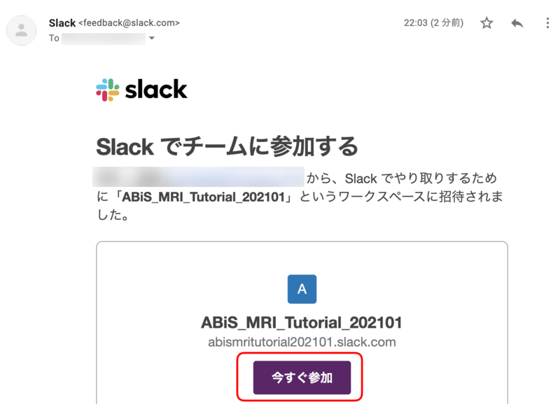

- Slackのアカウントを持っていない場合、アカウント作成画面が出てきます。Full nameに日本語の氏名、Passwordにご自身で決めたパスワードを入力し、"Create Account"をクリックしてください

	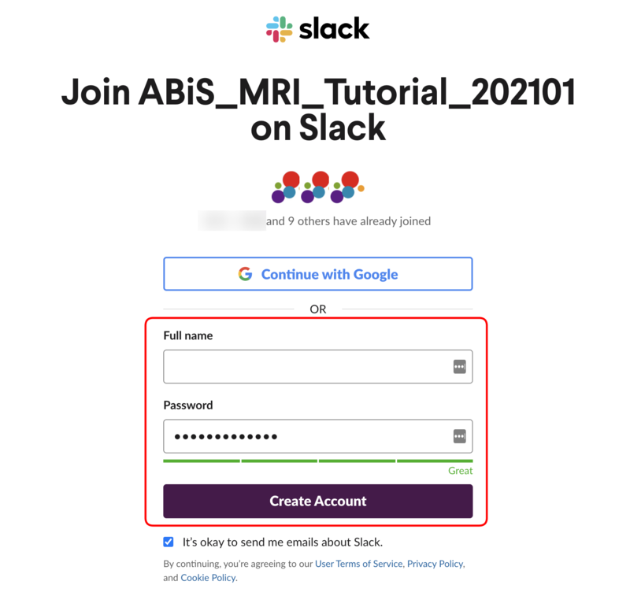

- Slackのアカウントを持っている場合、サインインを要求されますので、メールアドレスとSlack用のパスワードを入力してサインインしてください

	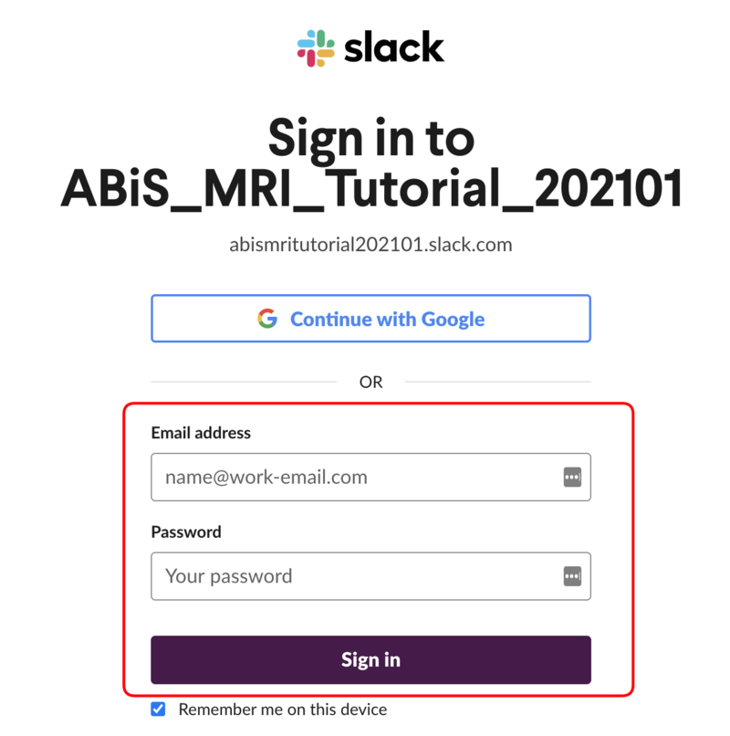

## アプリの入手

- 次に、[slackのダウンロードサイト](https://slack.com/downloads)にアクセスし、自分の使っているOSにあったSlackアプリをダウンロードしてください。Slackはブラウザからも利用可能ですが、アプリの方が使い勝手がいいかもしれません。スクリーンショットはMac版Slackとなっていますが、Windowsの方はWindows版をダウンロードしてください

	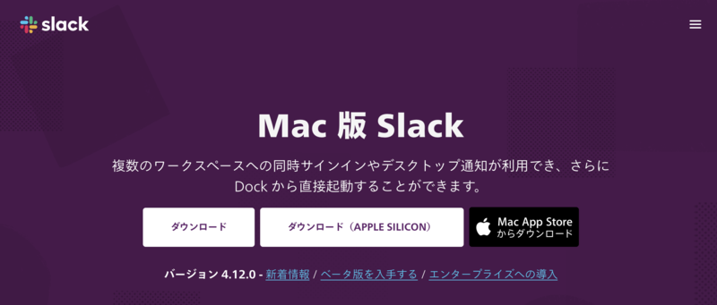

- アプリを起動すると、はじめての方の場合は、下図のような画面になりますので、"Sign In to Slack"をクリックします

	

- すでにSlackをお使いの方は、以下の3つのどれかの方法で、ワークスペースにサインインします

    - 左にある＋キーをクリックして、「他のワークスペースにサインインする」をクリックします

        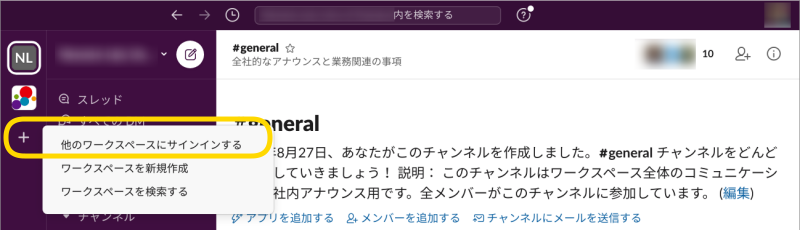

    - 左上のハンバーガーメニューをクリックし、「ワークスペースを追加」-> 「他のワークスペースにサインインする」をクリックします

        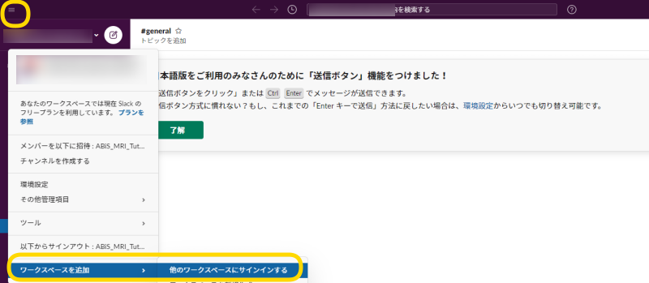

    - メニューの「ウィンドウ」から「他のワークスペースにサインインする」をクリックします

        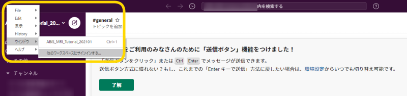

- サインイン画面が出ますので、メールアドレスを入力し、"Sign In with Email" をクリックします

	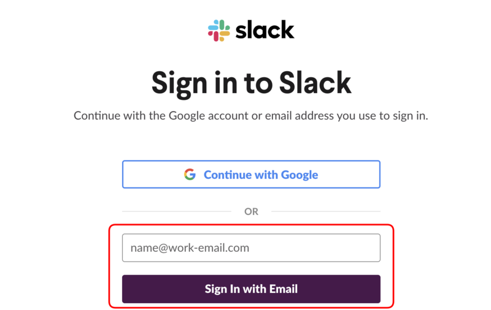

- そうすると、メールアドレスにサインインのためのコードが送信されますのでそれを入力します

	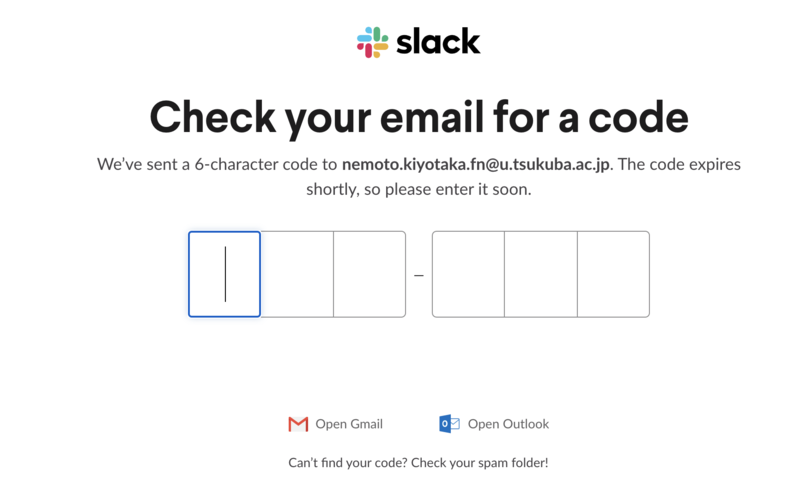

- ABiS_MRI_Tutorial_202101 をクリックします

	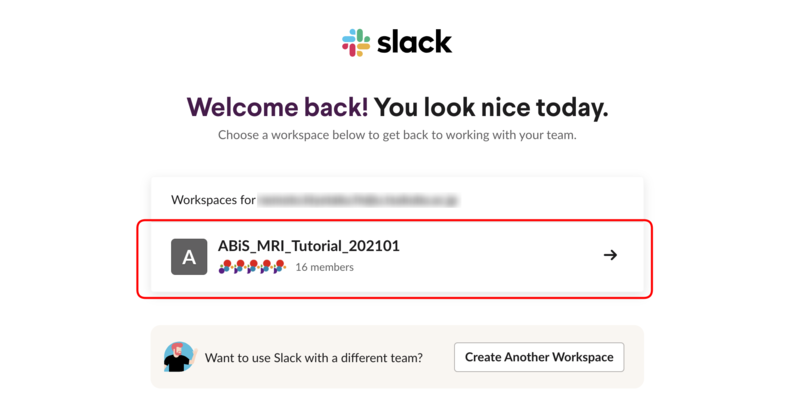

- "Slackを開きますか？"という質問が出た場合は、"Slackを開く"をクリックします

	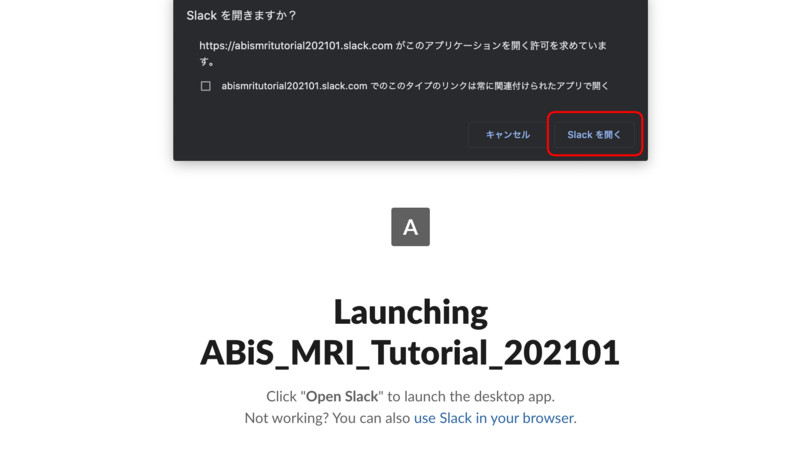

- そうすると、第9回ABiS用ワークスペースに入ることができます

	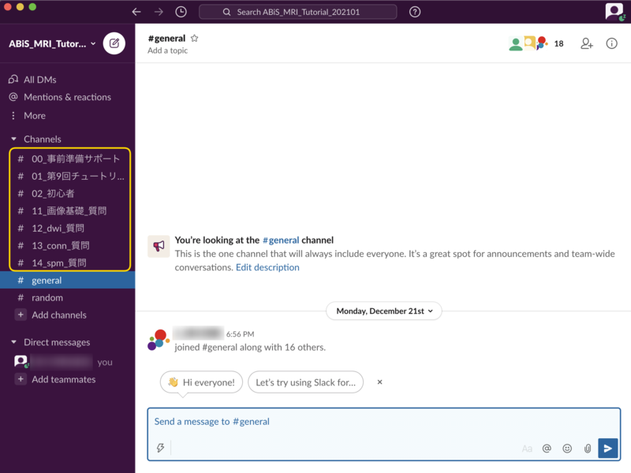

## チャンネルの使い分け

- いくつかチャンネルが準備されています。以下のように使い分けていきます

	- 00_事前準備サポート: 事前準備に関する連絡を行うチャンネルです。テキストのアップデートの連絡などをこちらで行います

	- 01_第9回チュートリアル: チュートリアル当日の全般的な事務連絡を行うチャンネルです。当日の出席確認、スケジュール変更、アンケートリンクなどはすべてこちらから発信します

	- 02_初心者: チュートリアルにおいて、「講師に聞くほどでもないけど、初心者だから聞いておきたい」質問を受けるチャンネルです。講義中、講師はこのチャンネルは見ません。その代わり、チューターが皆様の質問に対してお答えします。

    - 03_mac_native: Lin4Neuroを使わずにmacOS native環境で受講する方もいらっしゃるかと思います。macOSは多岐にわたるため、サポートは困難なのですが、有意義と思われる情報はこちらに載せさせていただきます。

	- 11_画像基本_質問: 第1部の講義に関する質問を受けるチャンネルです。

	- 12_DWI_質問: 第2部の講義に関する質問を受けるチャンネルです。

	- 13_CONN_質問: 第3部の講義に関する質問を受けるチャンネルです。

	- 14_SPM_質問: 第4部の講義に関する質問を受けるチャンネルです。

## お願い

- チュートリアルでは、すべて実名でやりとりをしたいと思います。ニックネームではなく、ご自身の名前をフルネームで表示するようにしてください。スタッフはすべて氏名の前にS_がついています

- テキストだけのやりとりになりますので、どうぞやわらかな言葉での発言をしていただくようにお願いいたします。

